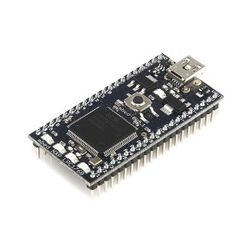
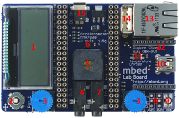

# Red Hat/ARM IoT BOF/Hackfest
 + 

Summary: A collection of projects that interfaces with the
[Sensinode Developer](https://silver.arm.com/browse/SEN00) NanoService 1.11 Developer
Release to expose the sensors of [mbed LPC1768](https://mbed.org/platforms/mbed-LPC1768/) +
[mbed Application Board](https://mbed.org/components/mbed-Application-Board/) combination
as POJOs in the JBoss Wildfly server.

### mbed LPC1768

### mbed Application Board

#### Application Board Feature list

1. 128x32 Graphics LCD
2. 5 way joystick
3. 2 x Potentiometers
4. 3.5mm Audio jack (Analog Out)
5. Speaker, PWM Conencted
6. 3 Axis +/1 1.5g Accelerometer
7. 3.5mm Audio jack (Analog In)
8. 2 x Servo motor headers
9. RGB LED, PWM connected
10. USB-mini-B Connector
11. Temperature sensor
12. Socket for for Xbee (Zigbee) or RN-XV (Wifi)
13. RJ45 Ethernet conenctor
14. USB-A Connector
15. 1.3mm DC Jack input

# Introduction
---------------------

This project includes EE7 component projects that illustrate connecting to the ARM NSP server to expose the sensor information as POJOs.

* iotbof-ear : The EE7 EAR containing the project EJB, WAR
* iotbof-ejb : An EE7 singleton EJB that connects to the NSP
* iotbof-rest : A wrapper api that communicates with the NSP endpoints using REST
* iotbof-test : Tests for the project elements
* iotbof-web : A web application that receives push notifications of sensor information
as well as simple web pages for viewing the sensor data.

## Requirements
You will need a Java SE 7 JDK instllation, and Maven 3+ in order to build and run the project. We don't specify how to install these here, but if you do need them, see:

* [Java SE Downloads](http://www.oracle.com/technetwork/java/javase/downloads/index.html)
  * [Current release, 7u51](http://www.oracle.com/technetwork/java/javase/downloads/jdk7-downloads-1880260.html)
* [Maven Downloads](http://maven.apache.org/download.cgi)
  * [Use release, Maven 3.0.5](http://mirrors.gigenet.com/apache/maven/maven-3/3.0.5/binaries/apache-maven-3.0.5-bin.zip)

# Wildfly Setup
-------------------
We need the JBoss [Wildfly](http://wildfly.org) Java EE7 server implementation for this BOF. Here we describe how to download and configure the server.

* Download the EE7 release of Wildfly from [8.0.0.Final Download](http://download.jboss.org/wildfly/8.0.0.Final/wildfly-8.0.0.Final.zip)
* Unzip the the release to create a wildfly-8.0.0.Final directory that will be referred to as wildfly.home

## Wildfly Configuration
There are a few @Resource injections from JNDI that need to be configured in the wildfly server configuration to specify the correct locations for the NSP server, it's domain, and the location of the iotbof-web project NspNotificationService. The configuration file that needs to be edited is iotbof/scripts/pom.xml.

Pull the pom.xml file into an editor, and edit the properties section shown here:

    <properties>
        <!-- The NSP server domain. Probably won't need to change. -->
        <NSPDomain>domain</NSPDomain>
        <!-- The base URL for the NSP REST interface -->
        <NSPURL>http://red-hat-summit.cloudapp.net:8080/</NSPURL>
        <!-- The username used to login to the NSP server -->
        <NSPUsername>hackN</NSPUsername>
        <!-- The password used to login to the NSP server -->
        <NSPPassword>hackN</NSPPassword>
        <!-- The ip address your laptops public network interface as assigned by DHCP -->
        <wildfly.host>mydmz.shomehost.com</wildfly.host>
    </properties>

* The NSPDomain binding provides the domain name on the NSP server for the sensors.
* The NSPURL provides the base URL for the NSP REST interface
* The NSPUsername is the username used to login to the NSP server. You will be given one for your group.
* The NSPPassword is the password used to login to the NSP server. You will be given one for your group.
* The wildfly.host is the public NIC IP address your Wildfly server is bound to.

## Building the Project
To build the project and bring up the NSPViewer application running under Wildfly, perform the following steps:

1. wget http://download.jboss.org/wildfly/8.0.0.Final/wildfly-8.0.0.Final.zip
    1. `unzip wildfly-8.0.0.Final.zip`
    2. Note the path to the wildfly-8.0.0.Final directory as it will be used a wildfly.home in configurations
2. `git clone https://github.com/starksm64/DevNation2014.git` to create the DevNation2014 repository
3. `cd DevNation2014`
4. Set JAVA_HOME if needed
5. edit the project root pom.xml and
	1. set the wildfly.home property to the directory path noted above
	2. cd into the scripts directory and run `mvn wildfly:start wildfly:execute-commands`
6. cd back to DevNation2014 and build the project by running `mvn install`
7. `cd iotbof-ear`
8. Run the application by running `mvn wildfly:run`
9. Now you should be able to open http://${wildfly.host}/iotbof-web/index.xhtml in your brower to view the NSPViewer application.

#
# Trouble Shooting

## Compilation errors
If you see a compilation error like the following while building the project using step 6 above:

	[INFO] -------------------------------------------------------------
	[ERROR] COMPILATION ERROR : 
	[INFO] -------------------------------------------------------------
	[ERROR] Failure executing javac, but could not parse the error:
	javac: invalid target release: 1.7
	Usage: javac <options> <source files>

then the java being picked up by default is Java 6 or lower. Explicitly export a JAVA_HOME that points to a JDK install of Java 7.

## Duplicate resource error

If the server fails to startup in step 8, and you see an error like the following:

[ERROR] Failed to execute goal org.wildfly.plugins:wildfly-maven-plugin:1.0.1.Final:run (default-cli) on project iot-ear: The server failed to start: Deployment failed and was rolled back. "JBAS014803: Duplicate resource [(\"deployment\" => \"iot-ear.ear\")]" -> [Help 1]

Edit your ${wildfly.home}/standalone/configuration/standalone.xml file and remove the deployments section at the end of the file:

	    </socket-binding-group>
	
	    <deployments>
	        <deployment name="iot-ear.ear" runtime-name="iot-ear.ear">
	            <content sha1="c27977d4ddd3dcd08ac3849ad34f27198380a4d6"/>
	        </deployment>
	    </deployments>
	</server>

The server is getting confused about the iot-ear.ear deployment for some reason that I have not figured out as yet.

## Missing JNDI bindings
Check the JNDI namespace of the server by running
`${WILDFLY_HOME}/bin/jboss-cli.sh -c --command=/subsystem=naming:jndi-view`

Sometimes you need to control the interface or http port your local wildfly instance uses. These can be set by adding a system-properties section to your wildfly-8.0.0.Final/standalone/configuration/standalone.xml file like the following:

    <system-properties>
        <property name="jboss.bind.address" value="127.0.0.1"/>
        <property name="jboss.http.port" value="8088"/>
    </system-properties>

## Notifications could not be enabled
If you see a warning about Notifications could not be enabled, then the NotificationCallbackURL is not accessible by the NSP server. Either the URL has a typo, or the port is not getting through the firewall/router you are behind are the typical problems I have run into.

## USB Terminal

Mac: [CoolTerm](http://freeware.the-meiers.org/CoolTermMac.zip) is a simple serial port terminal application (no terminal emulation) that is geared towards hobbyists and professionals with a need to exchange data with hardware connected to serial ports such as servo controllers, robotic kits, GPS receivers, microcontrollers, etc.

minicom is what to use for linux.
yum install minicom

## SSH tunnel

on laptop
ssh -N -R 8083:localhost:8083 dmz.starkinternational.com
on dmz.starkinternational.com
ssh -N -L 192.168.1.107:8083:localhost:8083 locahost

Not sure why this won't work on laptop:
ssh -R 192.168.1.107:8083:127.0.0.1:8083 -N dmz.starkinternational.com
